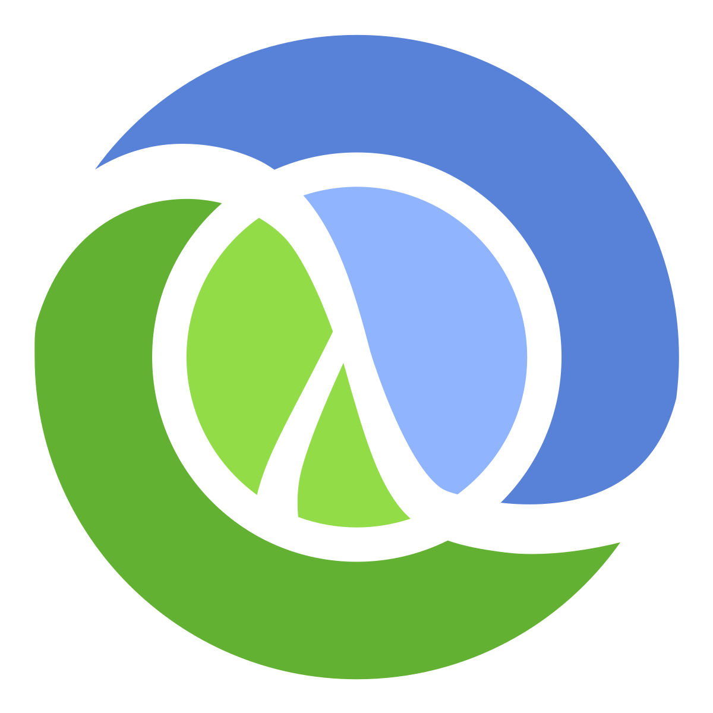

<p align="center">
  
</p>

# Clojure Labs

Base de conhecimento sobre **Clojure** do Caramelo Tech, com foco em programação funcional para iniciantes.

As notas deste repositório são publicadas no site do [Caramelo Labs](https://caramelotech.com.br/labs/clojure/).

## O que você vai encontrar

- Anotações sobre fundamentos de Clojure e programação funcional
- Projeto Leiningen com namespaces práticos para explorar no REPL
- Exercícios hands-on para fixação de conceitos
- Mini projetos aplicados

## Conteúdo

| Tópico                      | Descrição                                                                              |
| --------------------------- | -------------------------------------------------------------------------------------- |
| Introdução ao Clojure       | Ambiente, sintaxe, modelo mental funcional (vs OO), atalhos, threading e boas práticas |
| Coleções                    | Vetores, mapas, reduce, ordenação, lazy vs eager                                       |
| Refs, Átomos e Concorrência | Filas persistentes, threads, átomos e retries                                          |
| Testes                      | clojure.test, arquitetura hexagonal e Diplomat Architecture                            |

## Estrutura do repositório

```text
clojure-labs/
├── notes/           → Anotações em Markdown puro (publicadas no site do Caramelo Labs)
├── sidebar.json     → Seções da barra lateral no site
├── examples/        → Projeto Leiningen com exemplos, exercícios e projetos
└── .github/         → Workflows, templates e guias de contribuição
```

Este repositório contém **apenas conteúdo** - não há build, dependências ou configuração de site. A estrutura web (Astro + Starlight) vive no repositório hub [labs](https://github.com/caramelotech/labs), que busca as notas daqui a cada atualização e publica o site.

## Escrevendo notas

As notas em `notes/` são Markdown puro, sem frontmatter:

- A primeira linha da nota deve ser o título: `# Título da Nota`
- Use prefixo numérico no nome do arquivo para controlar a ordem na barra lateral: `introducao.md`, `2-exemplos.md`
- Agrupe por tema em subpastas (`introducao/`, `colecoes/`, ...)
- Imagens ficam junto das notas (ex: `notes/secao/assets/img.png`) e são referenciadas com caminho relativo: ``
- Links para outras notas do site usam o caminho completo: `/labs/clojure/<secao>/<nota>/`

Ao criar uma nova subpasta de tema, adicione a seção correspondente em `sidebar.json`.

## Como usar

1. Comece pelas anotações em `notes/` (ou pelo [site](https://caramelotech.com.br/labs/clojure/))
2. Explore o projeto Leiningen em `examples/` via REPL
3. Resolva os desafios em `examples/exercises.md`
4. Construa os projetos em `examples/projects.md`

## Trabalhando com os exemplos Clojure

O diretório `examples/` continua sendo um projeto Leiningen funcional.

```bash
cd examples
lein repl
lein run
```

## Contribuição

Contribuições são bem-vindas. Veja o [Guia de Contribuição](.github/CONTRIBUTING.md) para detalhes.

## Licença

MIT
