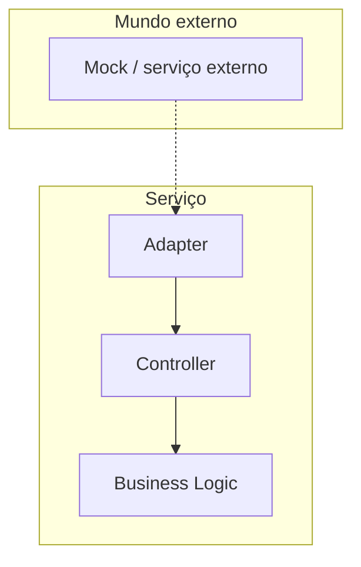

# Onde o teste unitário se encaixa

## Arquitetura hexagonal (Ports & Adapters)

A arquitetura hexagonal (também chamada de Ports & Adapters, proposta por Alistair Cockburn) organiza o código em camadas concêntricas, isolando a lógica de negócio de tudo que é externo ao sistema: banco de dados, filas, chamadas HTTP, frameworks.



- **Business Logic**: o núcleo. Regras de negócio puras, sem saber nada sobre HTTP, banco ou fila.
- **Controllers**: orquestram a chamada à lógica de negócio, validam entrada e formatam saída.
- **Adapters**: fazem a ponte com o mundo de fora (bancos, filas, APIs de terceiros), traduzindo entre o formato externo e o formato que a lógica de negócio entende.

O teste unitário cobre business logic, controllers e adapters, sempre isolando o que está fora do hexágono (bancos reais, filas reais, APIs de terceiros) com mocks ou stubs. Testar a integração de verdade com esses sistemas externos é papel do teste de integração, não do teste unitário.

## Estrutura de pastas de um serviço em Ports & Adapters

Um jeito comum de organizar um serviço Clojure nesse estilo:

```
src/service_name/
  adapters/
  controllers/
  db/
  diplomat/
  logic/
  model/
  schemata/
  components.clj
  config.clj
  server.clj
  service.clj
test/
  unit/
  integration*/
```

- `logic/` guarda as funções puras com as regras de negócio, o coração do hexágono
- `controllers/` chama `logic/` e decide o que fazer com o resultado
- `adapters/` e `db/` conversam com banco de dados e outros mecanismos de persistência
- `diplomat/` é o apelido que o Nubank dá à camada de adapters nesse estilo de arquitetura (a "Diplomat Architecture"), que converte entre o schema externo e o schema interno - veja a nota [Diplomat Architecture: o Ports & Adapters do Nubank](/labs/clojure/tests/3-arquitetura-diplomat/) para os detalhes
- `model/` e `schemata/` guardam as estruturas de dados e validações de schema usadas pelo serviço
- `test/unit/` espelha essa mesma estrutura para os testes unitários, enquanto `test/integration/` guarda os testes que sobem dependências reais (ou próximas do real) para validar a integração ponta a ponta

As pastas marcadas com `*` (`postman*/`, `integration*/`) indicam conteúdo opcional, que nem todo serviço precisa ter.

## Por que isso importa: idempotência e reprocessamento seguro

Um dos ganhos de modelar sua lógica com funções puras e imutabilidade é que fica mais fácil tornar as operações do serviço **idempotentes**: repetir a mesma operação várias vezes produz o mesmo resultado da primeira vez, sem duplicar efeitos colaterais.

Isso muda a forma de modelar uma operação. Em vez de pensar nela como algo que só produz um efeito e não devolve nada:

```
f(mensagem) -> void
```

Você modela como uma transformação de estado, que recebe o mundo atual e devolve um novo mundo:

```
f(mensagem, mundo) -> novo-mundo
```

Na prática, isso significa: se uma mensagem de "cobrar R$ 50" for processada duas vezes por causa de um retry de rede, o serviço não cobra R$ 100. Ele reconhece que aquela operação já aconteceu e devolve o mesmo resultado, sem repetir o efeito colateral. Isso facilita bastante lidar com erros e falhas de rede, porque reprocessar deixa de ser arriscado.

A imutabilidade do Clojure ajuda demais nesse jogo: como os valores não mudam por baixo dos seus pés, fica mais simples raciocinar sobre o que aconteceu quando várias operações rodam em paralelo ou concorrentemente, sem efeitos colaterais escondidos disputando o mesmo estado.

## Referências

- [Ports & Adapters Architecture ou Arquitetura Hexagonal](https://medium.com/bemobi-tech/ports-adapters-architecture-ou-arquitetura-hexagonal-b4b9904dad1a) - Augusto Marinho, Bemobi Tech, pt-BR
- [Design: Ports and Adapters (Arquitetura Hexagonal)](https://dev.to/wsantosdev/design-ports-and-adapters-48mi) - wsantosdev, pt-BR
- [Idempotência em requisições HTTP](https://www.dio.me/articles/idempotencia-em-requisicoes-http) - Juan Lira, DIO, pt-BR
- [Idempotência em APIs REST: o que é e como implementar](https://blog.hubdodesenvolvedor.com.br/idempotencia-em-apis-evitar-duplicidade-registros/) - Blog Hub do Desenvolvedor, pt-BR
