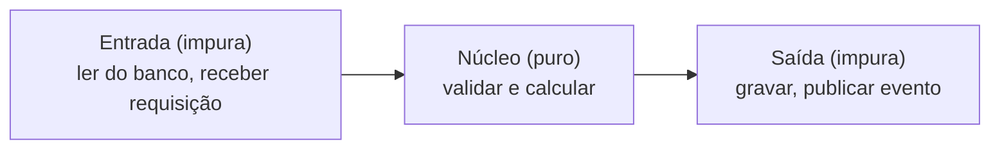

# Arquitetura hexagonal com funções: functional core, imperative shell

A nota [Onde o teste unitário se encaixa](/labs/clojure/tests/2-onde-testar/) apresenta a arquitetura hexagonal em termos gerais. Aqui vai uma pergunta mais específica: como ela fica quando o "miolo" é feito de funções puras e dados imutáveis em vez de classes? Adianto: muita coisa fica mais simples, mas nem tudo desaparece, e há mais de um jeito de fazer.

## O peso da hexagonal em camadas OO

Em muitos projetos Java, a hexagonal acaba desenhada como uma fila de camadas:

```text
Controller -> Service -> Domain -> Repository
```

O caso típico é o `Service` fazer todo o trabalho e o `Domain` virar um saco de getters e setters:

```java
class CriarPedidoService {
    void executar(Pedido pedido) {
        validar(pedido);
        calcularTotal(pedido);
        repository.salvar(pedido);
    }
}
```

Martin Fowler descreveu esse anti-padrão em 2003 como **Anemic Domain Model**: objetos que parecem um modelo de domínio, mas quase não têm comportamento, com a lógica concentrada numa camada de serviço. Ele criticava justamente isso, e lembra que a camada de serviço deveria ser fina, só coordenando, com a regra de negócio dentro do domínio.

Repare que o defeito é o modelo anêmico, não a hexagonal e nem a orientação a objetos em si. Um domínio OO bem feito, com comportamento nas classes, não sofre disso. O que o modelo anêmico traz de sobra é cerimônia: interfaces para cada port, DTOs para atravessar cada camada e testes cheios de mock para isolar o `Service`. A programação funcional ataca esse excesso por outro ângulo, como as próximas seções mostram.

## Domínio como dados + funções puras

Sem classes, o domínio fica em dois tipos de coisa: mapas com os dados e funções puras com as regras.

```clojure
(defn total-dos-itens [itens]
  (reduce + (map #(* (:quantidade %) (:preco-unitario %)) itens)))

(defn adicionar-total [pedido]
  (assoc pedido :total (total-dos-itens (:itens pedido))))

(defn validar [pedido]
  (when (seq (:itens pedido)) pedido))   ; devolve nil se o pedido é inválido
```

Nada aí importa banco, framework ou fila. O domínio depende apenas dos próprios dados, e isso é o que a hexagonal quer: um núcleo que não sabe onde está rodando. Se o conceito de função pura ainda não está claro, veja [O que testar: funções puras](/labs/clojure/tests/1-introducao/) e a seção de programação funcional de [Sintaxe Básica](/labs/clojure/introducao/2-sintaxe-basica/).

## Ports como funções

Na definição original de Alistair Cockburn, uma **port** é uma conversa com propósito entre a aplicação e o mundo externo, definida por uma API, e um **adapter** converte essa API para o que cada dispositivo externo entende. Nada nisso exige uma `interface` Java: a interface é uma das formas de expressar uma port, uma função é outra.

Se o use case só precisa de uma operação (salvar, por exemplo), basta receber a função como argumento. Quando são várias, um mapa de dependências agrupa tudo:

```clojure
(defn criar-pedido [deps pedido]
  (when-let [pronto (some-> pedido validar adicionar-total)]
    ((:salvar deps) pronto)))
```

Em produção, `(:salvar deps)` grava no banco. No teste, pode ser qualquer função:

```clojure
(criar-pedido {:salvar identity}
              {:itens [{:quantidade 2 :preco-unitario 80}]})
;; => {:itens [{:quantidade 2, :preco-unitario 80}], :total 160}
```

Quando a port tem várias operações relacionadas e você quer despachar pelo tipo da implementação, aí um _protocol_ faz sentido. Ele também gera uma interface Java correspondente, então convive bem com código Java:

```clojure
(defprotocol RepositorioDePedidos
  (salvar [this pedido])
  (buscar [this id]))
```

Ou seja: a FP não elimina a necessidade de abstrair o mundo externo. Ela só deixa de obrigar você a criar uma interface e uma classe para casos em que uma função resolve.

## Use case como pipeline

Um use case vira uma sequência de transformações. Em `criar-pedido` acima, o `some->` encadeia `validar` e `adicionar-total` e para no primeiro `nil` (já apareceu em [Introdução ao clojure.test](/labs/clojure/tests/1-introducao/), na seção sobre `some->`):

```clojure
(some-> pedido validar adicionar-total)
```

Um aviso sobre esse tipo de exemplo: costuma-se mostrar só o pipeline feliz, `(-> pedido validar calcular-total salvar)`, e omitir o que acontece quando `validar` falha. Aqui a validação devolve `nil` e o `some->` interrompe a cadeia, mas em sistemas reais você provavelmente precisa dizer _por que_ falhou (uma lista de erros, por exemplo). Trate esses trechos como esboço, não como receita completa.

## Efeitos colaterais na borda: functional core, imperative shell

A divisão que a hexagonal pede (domínio puro de um lado, infraestrutura impura do outro) tem nome em FP: **functional core, imperative shell**, tema que Gary Bernhardt aborda na palestra _Boundaries_ e em um screencast chamado _Functional Core, Imperative Shell_. O núcleo é feito de funções puras que só dependem dos próprios argumentos. A casca ao redor faz o I/O, chama o núcleo e aplica os efeitos no resultado.



Mark Seemann descreve um desenho parecido como sanduíche impuro-puro-impuro: primeiro coleta os dados (impuro), depois decide com funções puras, por fim faz algo com o resultado (impuro). Em código, o núcleo não recebe dependência nenhuma, só dados:

```clojure
;; Núcleo: dados entram, dados saem
(defn preparar-pedido [pedido]
  (some-> pedido validar adicionar-total))

;; Casca: faz o I/O e chama o núcleo (buscar-itens! e salvar-pedido! falam com o banco)
(defn processar-pedido! [pedido-id]
  (let [itens  (buscar-itens! pedido-id)
        pedido (preparar-pedido {:id pedido-id :itens itens})]
    (when pedido (salvar-pedido! pedido))))
```

O sufixo `!` é só uma convenção de Clojure para sinalizar funções com efeito colateral.

Isso não é o mesmo que o `criar-pedido` da seção anterior, e vale saber a diferença. Passar `deps` como argumento é **injeção de dependência por função**: o use case continua sendo o dono da chamada ao banco, só que através de um parâmetro. Seemann defende o oposto, a _dependency rejection_: se uma função depende de algo impuro, ela mesma passa a ser impura, então o melhor é empurrar o I/O para as bordas e deixar o núcleo sem dependências.

Nenhum dos dois estilos vence sempre:

- Injetar funções é direto e conhecido de quem vem de OO, mas o use case fica impuro e pede fakes para testar.
- O sanduíche deixa o núcleo trivial de testar, mas fica desconfortável quando o fluxo intercala decisões puras e chamadas impuras (o próprio Seemann cita como exemplo um fluxo de autenticação em dois passos).

## Testando núcleo e borda

O núcleo puro se testa sem nenhum test double, porque não há nada para substituir:

```clojure
(deftest preparar-pedido-test
  (is (= {:itens [{:quantidade 2 :preco-unitario 80}] :total 160}
         (preparar-pedido {:itens [{:quantidade 2 :preco-unitario 80}]})))
  (is (nil? (preparar-pedido {:itens []}))))
```

A borda e as integrações continuam precisando de algo no lugar do banco. Se o use case recebe `deps`, a função fake entra pelo argumento, como no `identity` mostrado antes. Se a função chama outras funções diretamente, como o `processar-pedido!`, dá para redefinir temporariamente com `with-redefs`:

```clojure
(deftest processar-pedido-test
  (with-redefs [buscar-itens! (fn [_] [{:quantidade 2 :preco-unitario 80}])
                salvar-pedido! identity]
    (is (= 160 (:total (processar-pedido! 1))))))
```

Um cuidado com o `with-redefs`: a documentação avisa que as redefinições são visíveis em todas as threads. Se seus testes rodarem em paralelo, uma redefinição pode vazar para outro teste.

Então "em Clojure não precisa de mock" vale para o núcleo. Na borda, a técnica muda (função fake, `with-redefs`), mas a necessidade de isolar o mundo externo continua.

## Mapeamento hexagonal: OO vs FP

| Peça da hexagonal | Em OO (Java)                                               | Em FP (Clojure)                                                                |
| ----------------- | ---------------------------------------------------------- | ------------------------------------------------------------------------------ |
| Domínio           | classes com comportamento (ou só dados, no modelo anêmico) | mapas + funções puras                                                          |
| Port              | interface                                                  | função recebida como argumento, ou protocol para várias operações relacionadas |
| Adapter           | classe que implementa a interface                          | função concreta que fala com banco, fila ou API                                |
| Use case          | classe de serviço                                          | função que compõe o núcleo, ou casca que chama o núcleo                        |
| Testes            | mock do repositório                                        | núcleo sem test double; borda com função fake ou `with-redefs`                 |

Esse mapeamento aparece de forma concreta na [Diplomat Architecture](/labs/clojure/tests/4-arquitetura-diplomat/), a versão da hexagonal usada nos serviços Clojure do Nubank: business logic com funções puras, controllers, adapters e ports, cada camada com sua estratégia de teste.

## Referências

- [Hexagonal architecture](https://alistair.cockburn.us/hexagonal-architecture/) - Alistair Cockburn, en
- [Anemic Domain Model](https://martinfowler.com/bliki/AnemicDomainModel.html) - Martin Fowler, en
- [Boundaries](https://www.destroyallsoftware.com/talks/boundaries) - Gary Bernhardt, SCNA 2012, en (palestra)
- [Dependency rejection](https://blog.ploeh.dk/2017/02/02/dependency-rejection/) - Mark Seemann, en
- [Protocols](https://clojure.org/reference/protocols) - clojure.org, en
- [with-redefs](https://clojuredocs.org/clojure.core/with-redefs) - ClojureDocs, en
